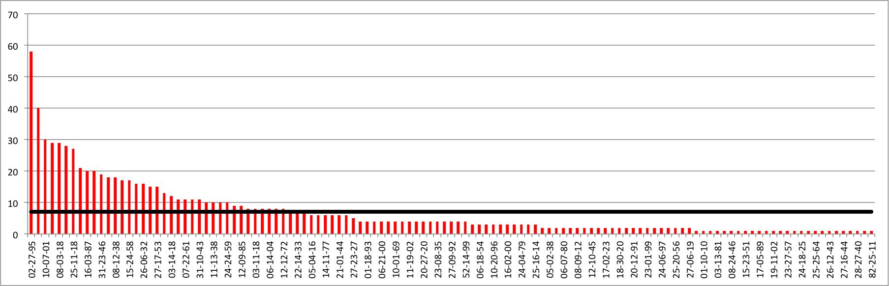

KoLaS enthält insgesamt 853 Texte aus dem Zeitraum September 2011 bis November 2016. Die Texte stammen von insgesamt 122 unterschiedlichen Ratsuchenden (RS). Die Anzahl der Texte oder Textversionen pro Ratsuchenden liegt im Durchschnitt bei 7 (schwarze Linie), ist aber großen Schwankungen unterworfen, wie die nachfolgende Abbildung „Anzahl Texte pro Ratsuchender:m“ verdeutlicht.

Von einer Person liegen ganze 58 Texte vor, von 26 Personen nur ein einziger Text. Damit liegen von 96 Ratsuchenden mindestens zwei Texte oder Textversionen vor, was die Bearbeitung interessanter Forschungsfragen ermöglicht.
Die zeitliche Verteilung der Daten kann der untenstehenden Tabelle entnommen werden. Aus dem Jahr 2011 liegen nur wenige Dateien vor, da die *Schreibwerkstatt Mehrsprachigkeit* erst Ende des Jahres ihre Tätigkeit aufgenommen hat und die ersten Schreibberater:innen ausgebildet wurden. Die Diskrepanz zwischen der Anzahl der Texte und der Anzahl der Beratungen entsteht dadurch, dass Beratungen maximal wöchentlich stattfinden, ggf. aber auch dazwischen neue Textversionen entstehen, die den Schreibberater:innen zur Verfügung gestellt werden. 

| Jahr|  Texte| textbezogene Beratungen|
|----:|------:|-----------------------:|
| 2011|     28|  					 20|
| 2012|    228|  					176|
| 2013|    195|  					167|
| 2014|     87|  					 58|
| 2015|    170|  					126|
| 2016|    145|  					112|
| **Summe**|  **853**|  		**659**|

Zu den Ratsuchenden liegen eine Reihe von Metadaten vor, die spezifischere Analysen ermöglichen. Hierzu gehören insbesondere Informationen zum Studium (Fach, angestrebter Abschluss) und zur Sprachbiografie (Sprachen, mit denen die RS aufgewachsen sind, die sie in der Schule gelernt haben, Erstsprachen der Eltern …). Die im Korpus erfassten Ratsuchenden haben im Feld „aufgewachsen mit“ 26 unterschiedliche Sprachen angegeben (Mehrfachnennungen möglich). Mit 43 bzw. 19 Ratsuchenden sind Deutsch und Russisch die am häufigsten genannten Sprachen, weiterhin sind folgende Sprachen vertreten (alphabetisch): Albanisch, Arabisch, Aserbainisch, Bassa, Chinesisch, Englisch, Fanti, Französisch, Georgisch, Griechisch, Hindi, Indonesisch, Italienisch, Japanisch, Kasachisch, Katalan, Kirgisisch, Kroatisch, Kurdisch, Latein, Multani/Kandahari, Persisch/Farsi, Polnisch, Portugiesisch, Schweizer Deutsch, Serbisch, Slowakisch, Spanisch, Sundonesisch, Tschechisch, Türkisch, Twi, Ukrainisch, Vietnamesisch und Yuruba. Diese große Sprachenvielfalt ist vorteilhaft, da viele Sprach- und Kulturregionen einbezogen werden. Allerdings liegen dadurch momentan nur wenige Texte zu einer einzelnen Sprache vor, sodass das Erstellen von Teilkorpora nach Sprache bisher nur eingeschränkt möglich ist.

Die Ratsuchenden sind in ihrem Studium sehr unterschiedlich weit vorangeschritten, es sind Studierende vom ersten bis zum dreißigsten Semester vertreten, der Durchschnitt liegt bei 6 Semestern. In Bezug auf das Studienfach stammen die meisten Ratsuchenden aus der  Erziehungswissenschaft sowie den Sprach- und Kulturwissenschaften. Dieser Schwerpunkt hängt mit der ursprünglichen Zielgruppendefinition der *Schreibwerkstatt Mehrsprachigkeit* zusammen, die sich zunächst nur an „Lehramtsstudierende mit Migrationshintergrund“ richtete.

Die Textarten, mit denen die Studierenden in die Beratung kommen, sind ebenfalls sehr vielfältig. Die mit Abstand häufigste Textart ist die Hausarbeit, gefolgt von unterschiedlichen Typen von Abschlussarbeiten (BA-, MA-, Magister-, Diplom-Arbeiten). In geringerer Häufigkeit kommen Praktikumsberichte, Exposés, Protokolle, Essays oder auch Fragebögen vor.
